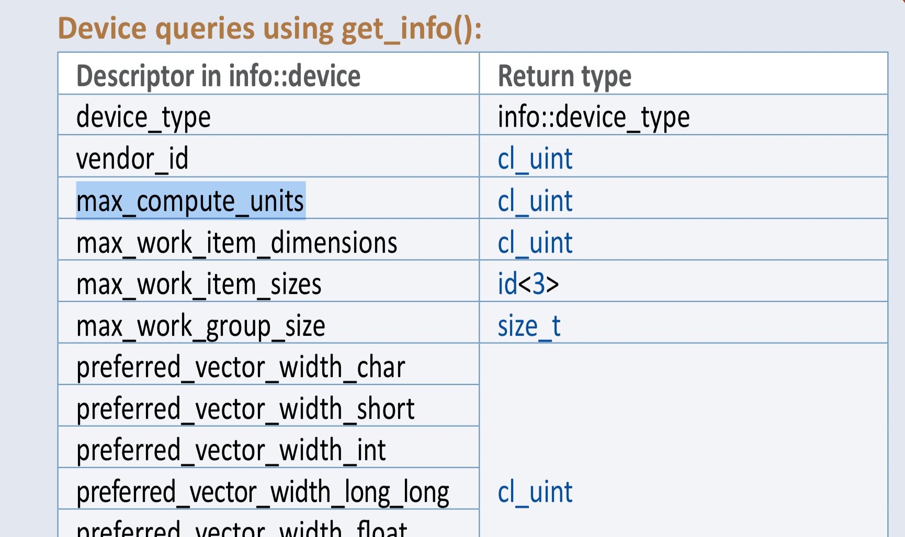
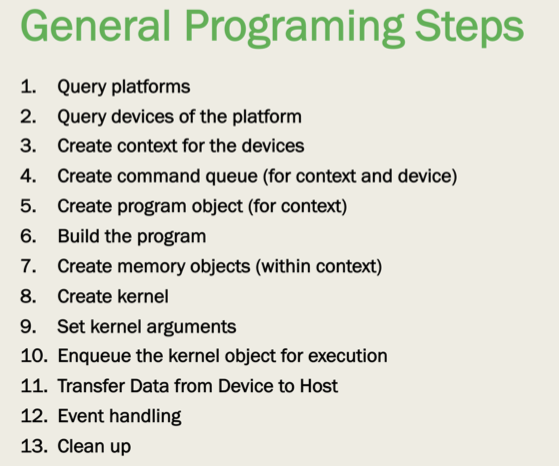
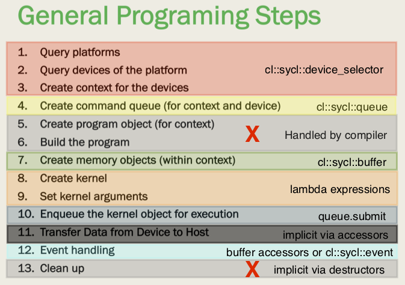

# SYCL Workshop
## May 31, 2019

Thomas Applencourt

Kevin Harms  

---

# Agenda

* C++ Review
* SYCL Overview
* Comparison to OpenCL
* Device Selection
* Queue Management
* Buffer Management
* Accessors
* Kernels
* Range Operators
* References
* Summary

---

### C++ Review -  Templates
- Templates allow creating code with a generic type
- Removes the need to write many virtual functions with different types
##### code
    !c++
    template <class T>
    class vec3 {
        T val[3];
        public:
            vec3 (T x, T y, Tz)
                { val[0] = x; val[1] = y; val[2] = z; }

    vec3<double>(1.0, 2.0, 3.0);
# Presenter Notes
- SYCL uses many C++ features, we need to review these to help understand the code
- point out generic type in example
- reason for code bloat and slow compile times

---
# C++ Review - Template functions and typename
- Template functions similar to Template classes
- Provide generic types for functions
##### example
    !c++
    template <typename T> void func (T a) { T b = a; return; }
    func<int>(4);
##### SYCL device class get_info example
    !c++
    using namespace cl::sycl;
    template <info::device param> typename info::param_traits< info::device, param>::type get_info() const;
    cl_uint eu = device.get_info<info::device::max_compute_units>();

# Presenter Notes
- similar to template classes
- SYCL makes heavy use of templates and typename keywords, need to understand these
- get_info returns a info::param_traits< info::device, param>::type where param is parameterized by <info::device param>
- ::type can be found from the reference guide table

---
# C++ Review - lambda
- Lambda[^1] is common in many languages, same concept in c++
- creates an anonymous function that can capture variables in scope

*[capture] (parameters) { body };*  
 -- [] capture nothing  
 -- [&] capture by reference  
 -- [=] capture by making a local copy  
 -- [a, &b] capture explicit variables  

##### example
    !c++
    void func (std::function<void(int)> f) { int x = 6; f(x); }
    {
        int a = 6;
        int *ptr = &a;
        func([&](int q){ if (q == *ptr) std::cout << "success"; }
    }

[^1]: https://en.cppreference.com/w/cpp/language/lambda

---
# C++ Review - lambda
- code submitted to the queue runs on the host and captures by reference
- code run under *single_task* function runs on the GPU and captures by value
##### SYCL kernel
    !c++
    {
        cl::sycl::buffer buf<int, 1>(cl::sycl::range<1>(100));
        int x = 5;
        q.submit([&](cl::sycl::handler &h) {
                auto buf_acc = buf.get_access<cl::sycl::access::read>(h);
                int y = x;
                h.parallel_for<class kernel>(cl::sycl::range<1>(100),
                    [=](cl::sycl::id<1> idx)
                    {
                        int i = idx[0];
                        int v = buf_acc[i] * y;
                    });
            });
        x = 6;
        q.wait();
    }
# Presenter Notes
- lambda passed to submit() is by reference
- sycl 4.8.2 indicates host code in submit should run before submit returns
  - y should be 5

---
# C++ Review - auto
- The *auto* keyword replaces the type and allows the compiler to determine the type from the initializer
- C/C++ is strongly typed, it's important to know types
- Templated code makes for ugly types
- *Avoid* using auto, leads to code that may be hard to understand later as all types are obfuscated

##### Example type
    !c++
    auto iter = mymap.begin();
    /* or */
    std::map<std::pair<std::string,std::string>,std::vector<int>>::iterator iter;
    iter = mymap.begin();

# Presenter Notes
- examples don't use auto (or try not to)

---
# C++ Review - const
- *const* has been around in C for many years
- modern C++ compilers are more strict about const correctness
- If your code looks right but you have an odd error about the LHS or RHS, could be due to a const correctness issue

<pre>
file.cpp:40:28: error: non-const lvalue reference to type
      'sycl::device_selector' cannot bind to a temporary of type
      'sycl::cpu_selector'
    sycl::device_selector &selector_cpu = sycl::cpu_selector();
</pre>

---
# SYCL Overview
- C++ Specification based on the OpenCL runtime
> ... royalty-free, cross-platform abstraction layer that builds on the underlying concepts, portability and efficiency of OpenCL that enables code for heterogeneous processors to be written in a “single-source” style using completely standard C++. SYCL single-source programming enables the host and kernel code for an application to be contained in the same source file, in a type-safe way and with the simplicity of a cross-platform asynchronous task graph. SYCL includes templates and generic lambda functions to enable higher-level application software to be cleanly coded with optimized acceleration of kernel code across the extensive range of shipping OpenCL 1.2 implementations.

- based on standard C++11
- Most concepts taken directly from OpenCL
    - platform, device, queue, buffer, NDRange (range), work groups and work items    
- build and create kernel aspects of OpenCL now handled implicitly in SYCL
    - done at compile time
- memory model is the same as OpenCL 1.2
- [https://www.khronos.org/sycl/](https://www.khronos.org/sycl/) 
---
# SYCL Code Overview
    !c++
    float local_data[1024]; // local host memory
    const cl::sycl::device_selector &gpu = cl::sycl::gpu_selector(); // select which device to run on
    cl::sycl::queue queue(gpu); // allocate all the SYCL/OpenCL runtime resources and attach to 'gpu'
    cl::sycl::buffer<float,1> input_data(local_buffer, cl::sycl::range<1>(1024)); // create SYCL managed buffer
    queue.submit([&](cl::sycl::handler &handler) // run a kernel on the GPU, lambda, capture by reference
        {
            // **code run on host**
            cl::sycl::accessor<float, 1, cl::sycl::access::mode::read> input_data_acc = \
                input_data.get_access<cl::sycl::access::mode::read>(handler);

            handler.parallel_for<class kernel>(cl::sycl::range<1>(1024),
                // **offloaded code**
                [=](cl::sycl::id<1> idx) // lambda, capture by value
                {
                    float v;
                    int   i;
                    i = idx[0];
                    v = input_data_acc[i] * 0.5;
                });
        });
    queue.wait()

# Presenter Notes
- namespace for OpenCL is cl, namespace for SYCL is cl::sycl
- gpu_selector - built-in which will select a GPU, you can write your own
- buffer - declares memory that will be managed by SYCL runtime, references memory defined on the host
- queue.submit - takes lambda which configures memory access and launches kernel
- buffer accessor - method for accessing memory managed/allocated by sycl::buffer
- kernel - offloaded code that accesses sycl::buffers and performs compute (run as one of three types)
- queue.wait() - synchronize all kernels running in this queue

---
# Comparison to OpenCL Structure

# Presenter Notes
- Same chart from Yasaman's OpenCL presentation on OpenCL program structure
- Events are optional

---
# Comparison to OpenCL Structure

# Presenter Notes
- This is how the structure maps to SYCL
- Events are still optional

---
# Device Selection
- SYCL provides the concept of a device selector which is a function that will choose which device to run on
- SYCL specification doesn't define what these devices are, OpenCL has brief descriptions
- cl::sycl::default_selector
    - implementation specific method to select a default device
- cl::sycl::cpu_selector
    - selects the host device
    - The host processor runs the OpenCL implementations and is a single or multi-core CPU.
- cl::sycl::gpu_selector
    - selects a GPU device
    - can be used to accelerate a 3D API such as OpenGL or DirectX.
- cl::sycl::accelerator_selector
    - selects an accelerator device
    - communicate with the host processor using a peripheral interconnect such as PCIe.

# Presenter Notes
- SYCL/OpenCL specification doesn't have clear definitions of what a device is
- can write a custom device selector to apply logic to select device
- A device can only have one type

---
# Device Selection Example
##### Example
    !c++
    cl::sycl::device_selector &device = cl::sycl::gpu_selector();
    cl::sycl::queue queue(device);

---
# Queue Management
- Queue constructor with the device selector binds to the queue to the device
- kernels submitted will run asynchronously
- *submit* - takes a function object to execute
    - runs host code portion synchronously
    - once kernel submitted to device, code is running asynchronously
    - errors during *submit()* or *wait()* reported synchronously via exceptions
- errors that occur after kernel submission are reported asynchronously and require defining an async_handler
    - *wait_and_throw* or *throw_asynchronous* must be called to run the handler
- queue object destructors will wait for queued kernels to complete before the destructor completes

# Presenter Notes
- a common asynch error is the workgroup size not being decomposable

---
# Queue Management Example
##### Example
    !c++
    cl::sycl::async_handler ah = \
         { for( auto &e : elist); { std::cout << e.what() << std::endl; } };

    cl::sycl::queue q(cl::sycl::default_selector(), ah);

    try {
        q.submit(...); // async error example would be workgroup size that can not be integer split
        q.wait_and_throw(); // and_throw required to catch asynch exceptions, wait will discard them
    }
    catch (cl::sycl::exception &e) // catch SYCL exceptions
    {
        std::cout << e.what() << std::endl;
    }
    catch (std::exception &e) // catch other exceptions
    {
        std::cout << e.what() << std::endl;
    }

---
# Buffer Management
- SYCL provides host managed memory in the form of buffer or image
- private memory local to a *workitem* can be allocated inside of
    - parallel_for or parallel_for_work_item
- memory local to a *workgroup* can be allocated inside of
    - parllel_for_work_group
    - accessor using cl::sycl::local_accessor
- cl::sycl::buffer
    - manages copying data back and forth between host and device
    - can be constructed with cl_mem object, host data, or allow SYCL to allocate
    - use accessors to get access to data (next topic)
- explicit copying is possible via *copy* interface provided by the cl::sycl::handler class
- cl::sycl::image
    - special instance of buffer the support image concepts such as channel order and image format

---
# Buffer Management Example
    !c++
    // user provides explicit memory to use
    double *data = malloc(sizeof(double) * 1000); //*
    data[0] = 1.0;
    // create buffer from existing memory allocation
    cl::sycl::buffer<double, 1> buf1(data, cl::sycl::range<1>(1000));

    // SYCL handles memory allocation and deallocation
    cl::sycl::buffer<double, 1> buf2(cl::sycl::range<1>(1000));

    // local memory
    queue.submit([&](cl::sycl::handler &h)
        {
            // Shared Local Memory (SLM) allocation
            cl::sycl::accessor<int, 1, cl::sycl::access::mode::read_write, cl::sycl::access::target::local> acc = \
                cl::sycl::accessor<int, 1, cl::sycl::access::mode::read_write, \
                        cl::sycl::access::target::local>(cl::sycl::range<1>(SIZE), h);
            h.parallel_for_work_group([=](id<1> idx)
                {
                    ... // workgroup code
                    acc[x] = 6; // write shared local memory
                    ... // parallel_for_work_item
                }
            );
        }
    );

---
# Accessor
- accessors are used to access memory from buffers, images or local memory
- inform runtime of your intent to access data and allows runtime to schedule access
- synchronize access to data
- five components
    - data type (int, float, etc.)
    - dimensions (1, 2, 3)
    - access mode (read, write, read_write, discard_write, discard_read_write, atomic)
    - target (type of memory: global_buffer, constant_buffer, local, host_buffer)
    - placeholder (defaults to false)

# Presenter Notes
    - accessors are key topic for correctly accessing data
    - discard variants will not copy data first
    - basis for generating dependency graphs
---
# Accessor Example
    !c++
    cl::sycl::buffer<double, 1> buf2(cl::sycl::range<1>(1000));

    queue.submit([&](cl::sycl::handler &h)
        {
        cl::sycl::accessor<int, 1, cl::sycl::access::mode::read_write, cl::sycl::access::target::global_buffer> b_acc = \
            buf2.get_access<cl::sycl::access::mode::read_write>(h);
        ... // kernel code
        }
    );

    cl::sycl::accessor<int, 1, cl::sycl::access::mode::read_write, cl::sycl::access::target::host_buffer> b_host_acc = \
        buf2.get_access<cl::sycl::access::mode::read_write>();

    // use b_host_acc on host side to allow runtime to synch access
    // will wait until data is copied back to host
    double v = b_host_acc[5];

---
# Kernels
- Three core types of Kernels
    - single_task - run one instance of the kernel, no local accessors
    - parallel_for - run number of instances based on workgroups and workitems
        - number of variants for different types of arguments
    - parallel_for_work_group - allows similar capability as with nd_range
        - can run workgroup code that runs only once for the workgroup
        - can allocate local memory and private memories
        - use parallel_for_work_item within to parallelize over work items
##### Example
    !c++
    q.submit([&](cl::sycl::handler &h)
        {
            h.single_task([=]() // no arguments
                {
                    // do stuff
                });
        });

# Presenter Notes
- single_task used for debugging or potentially data movement

---
# Range Operators
- SYCL provides seven classes to handle expressing data decomposition
    - range, nd_range
    - id, item, nd_item
    - group, h_item
- `range<dimensions>(<size of dimension>)`
    - range<1>(200)
    - range<2>(4, 2)
- `id<dimensions>` - provides the index into the range
    - id<1> a; size_t index = a[0];
    - id<2> b; size_t x = b[0]; size_t y = b[1];
- `nd_range<dimensions>(range<dimension> global_size, range<dimension> local_size)`
    - nd_range<1>(range<1>(256), range<1>(128))
- `nd_item<dimensions>` - provides index into the nd_range plus more functionality
    - nd_item<1> a; size_t global_index = a.get_global_id(); size_t local_index = a.get_local_id();

# Presenter Notes
    - start with range and id
    - experiment with nd_range and nd_item when you want to control decomposition
    - nd_item has memory barriers and copying functions

---
# range Example

    !c++
    q.submit([&](cl::sycl::handler &h)
        {
            auto acc = buf.get_access<cl::sycl::access::mode::discard_write>(h);
            h.parellel_for<class kernel>(cl::sycl::range<1>(4096),
                [=](cl::sycl::id<1> x)
                {
                    size_t i = x[0];
                    acc[i] = i;
                }
            );
        }
    );

---
# nd_range Example
    !c++
    cl::sycl:buffer<int, 1> buf(cl::sycl::range<1>(4096));
    q.submit([&](cl::sycl::handler &h)
        {
            auto acc = buf.get_access<cl::sycl::access::mode::discard_write>(h);
            h.parellel_for<class kernel>(cl::sycl::nd_range<1>(cl::sycl::range<1>(128),
                                                                cl::sycl::range<1>(64))
                [=](cl::sycl::nd_item<1> ndi)
                {
                    size_t gi = ndi.get_global_id();
                    size_t li = ndi.get_local_id();
                    // compute index manually
                    // size_t i = gi * ndi.get_global_range(1) + li;
                    // or let SYCL do the work for you
                    size_t i = ndi.get_global_linear_id();
                    acc[i] = i;
                }
            );
        }
    );

# Presenter Notes
- replace range with nd_range and id with nd_item
- compute index into memory using global and local indices or
- use get_global_linear_id() to allow SYCL to compute the offset according to formula in documentation

---
# References
- SYCL Specification - [https://www.khronos.org/registry/SYCL/specs/sycl-1.2.1.pdf](https://www.khronos.org/registry/SYCL/specs/sycl-1.2.1.pdf)
- SYCL Reference Sheet - [https://www.khronos.org/files/sycl/sycl-121-reference-card.pdf](https://www.khronos.org/files/sycl/sycl-121-reference-card.pdf)
- Codeplay examples - [https://github.com/codeplaysoftware/computecpp-sdk/tree/master/samples](https://github.com/codeplaysoftware/computecpp-sdk/tree/master/samples)
- Parallel Research Kernels - [https://github.com/ParRes/Kernels](https://github.com/ParRes/Kernels)
    - under Cxx11 directory

# Presenter Notes
- specification is useful, difficult to search due to differences in typographic symbols
    - underscore
---
# Summary
- SYCL just like OpenCL
    - if you like OpenCL, you will like SYCL, if not, look elsewhere
- SYCL leverages C++ syntax heavily
    - much of the verbosity and ugliness comes from C++ rather than something SYCL specific
